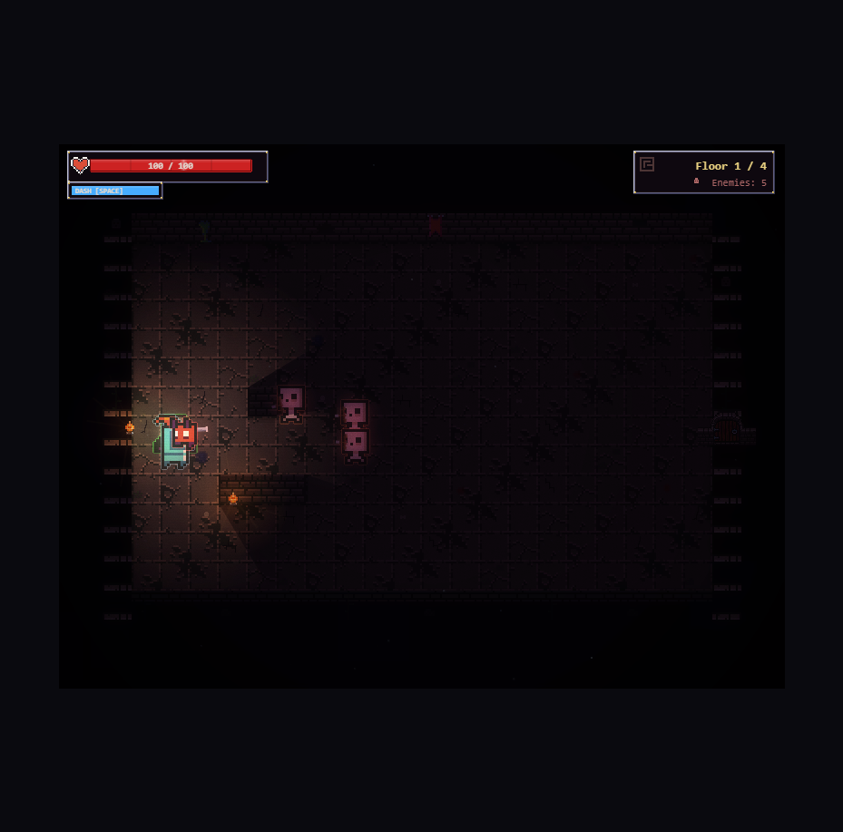
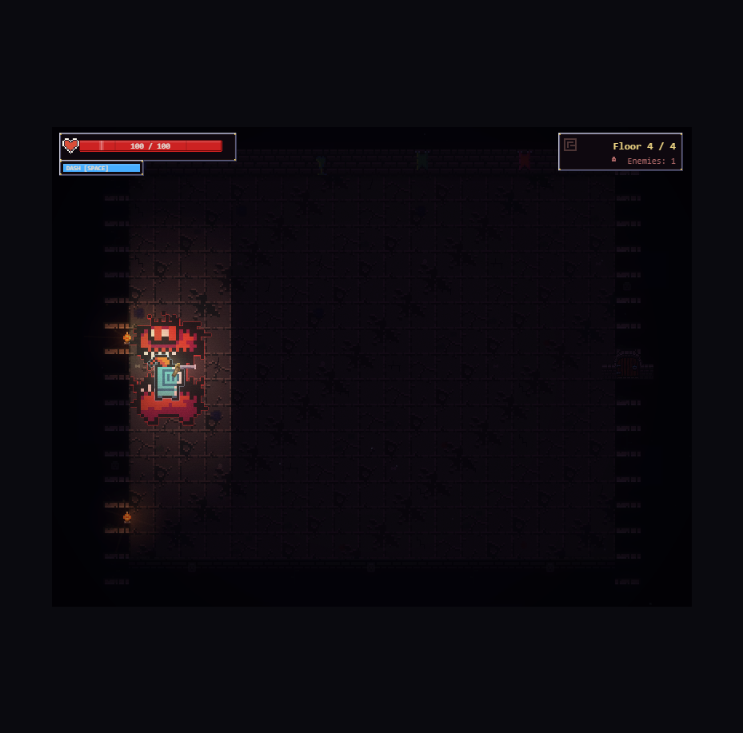

# Depths of the Dark Keep

A fantasy dungeon roguelike built entirely with HTML5 Canvas and vanilla JavaScript. No frameworks, no build tools — just pure code and pixel art.



## Demo

[](https://www.youtube.com/watch?v=92hhyZO8YmY)

> Click the image above to watch the gameplay demo on YouTube

## Play

**Live:** [Play on GitHub Pages](https://ben9730.github.io/game-with-claude/) *(deploy with instructions below)*

**Local:**
```bash
npx serve
```
Then open `http://localhost:3000`

## Controls

| Key | Action |
|-----|--------|
| **WASD** | Move |
| **Mouse** | Aim |
| **Left Click** | Sword slash |
| **Right Click** | Shield block |
| **Space** | Dash (i-frames) |
| **R** | Restart (on death/victory) |

## Gameplay

Fight through 4-5 procedurally generated dungeon rooms, defeat enemies, collect power-ups, and slay the Dark Knight boss.

- **3 enemy types:** Slimes (melee), Imps (flying), Skeleton archers (ranged)
- **Dark Knight boss** with 2 phases — charge attacks, sword swings, ground slams
- **Power-ups:** Health potions, speed boosts, attack buffs
- **Permadeath** — one run, no saves



## Tech Stack

- **Pure vanilla JavaScript** — 18 ES modules, zero dependencies
- **HTML5 Canvas 2D** — all rendering, no WebGL
- **0x72 DungeonTileset II** — CC0 pixel art sprites ([source](https://0x72.itch.io/dungeontileset-ii))
- **No build step** — just serve static files

## Visual Features

- Pixel art sprites with animated idle/run/hit frames
- Bloom post-processing (GPU-accelerated `ctx.filter`)
- Squash/stretch, hit stop, screen shake (trauma-based)
- Chromatic aberration on boss kills
- Slow-motion on dramatic moments
- Damage number popups
- Film grain + scanline overlays
- Ambient dust motes and torch embers
- Color grading per floor depth
- Pre-rendered room backgrounds for performance

## Project Structure

```
index.html          — entry point
src/
  main.js           — game loop, state machine, hit stop, slow-mo
  config.js         — palette, color ramps, constants
  sprites.js        — sprite sheet loading, animation, tile system
  renderer.js       — multi-layer render pipeline + post-processing
  rooms.js          — procedural room generation, tile rendering
  lighting.js       — torch system, fog
  effects.js        — bloom, vignette, color grading, film grain,
                      damage numbers, screen flash, chromatic aberration
  camera.js         — trauma-based screen shake
  player.js         — player state, combat, squash/stretch
  enemies.js        — slime/imp/skeleton AI + sprite rendering
  boss.js           — Dark Knight boss phases + effects
  particles.js      — typed particle system with additive blend
  hud.js            — health bar, dash cooldown, buff icons
  title.js          — title/game over/victory screens
  transitions.js    — room transition fades
  powerups.js       — item drops with flask sprites
  projectiles.js    — arrow projectiles
  input.js          — keyboard + mouse input
  utils.js          — math helpers, collision
assets/
  0x72_DungeonTilesetII_v1.7/  — pixel art tileset (CC0)
```

## Deploy to GitHub Pages

1. Go to your repo **Settings** > **Pages**
2. Under **Source**, select **Deploy from a branch**
3. Choose **master** branch, **/ (root)** folder
4. Click **Save**
5. Your game will be live at `https://ben9730.github.io/game-with-claude/`

That's it — no build step needed since the game is pure static files.

## Credits

- **Sprites:** [0x72 DungeonTileset II](https://0x72.itch.io/dungeontileset-ii) (CC0 license)
- **Built with:** [Claude Code](https://claude.ai/claude-code) by Anthropic
